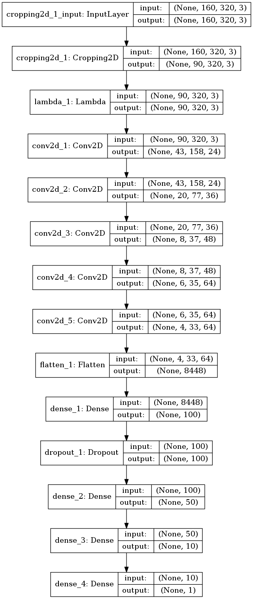
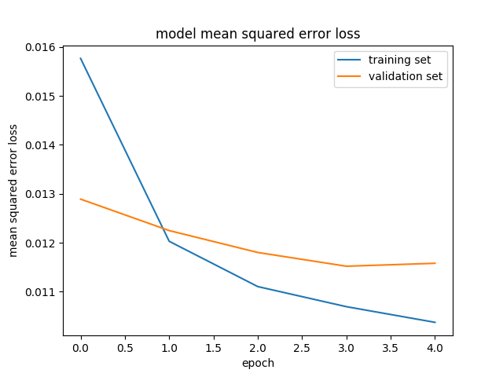

# **Behavioral Cloning** 
---

**Introduction**

The goals / steps of this project are the following:
* Use the simulator to collect data of good driving behavior
* Build, a convolution neural network in Keras that predicts steering angles from images
* Train and validate the model with a training and validation set
* Test that the model successfully drives around track one without leaving the road
* Summarize the results with a written report

## Rubric Points
---
### Files Submitted & Code Quality

#### 1. Submission includes all required files and can be used to run the simulator in autonomous mode

My project includes the following files:
* model.py containing the script to create and train the model
* drive.py for driving the car in autonomous mode
* model.h5 containing a trained convolution neural network 
* writeup_report.md summarizing the approach and results

#### 2. Submission includes functional code
Using the Udacity provided simulator and my drive.py file, the car can be driven autonomously around the track by executing 
```sh
python drive.py model.h5
```

#### 3. Submission code is usable and readable

The model.py file contains the code for training and saving the convolution neural network. The file shows the pipeline I used for training and validating the model, and it contains comments to explain how the code works.

## Overview
---
### Model Architecture and Training Strategy
#### 1. Training data
Training data given for the project was used. No additional data was collected. Preprocessing are done which is described in later section.
#### 2. Preprocessing
The training data includes three images per frame corresponding to left-, right-, and center-mounted cameras, each giving a different perspective of the track ahead. The data also includes a csv file which includes file paths for each of these images, along with the associated steering angle, throttle, brake, and speed for each frame.

The steering angles are corrected by +0.13 for the left frame and -0.13 for the right based on trial an error for effective seeting along the route. Initially 0.065 was chosen which proved to be ineffictive in traversing the final right turn of the lap. Hence this has to be increased to 0.13.

Images produced by the simulator in training mode are 320x160, and therefore require preprocessing prior to being fed to the CNN because it expects input images to be size 200x66. To achieve this, the bottom 20 pixels and the top 50 pixelsare cropped from the image and it is then resized to 200x66 using the Keras 2D corp layer in the model itself. This is to crop the hood of the car and the higher parts of the images which contain irrelevant sky/horizon/tree. Alsoi n addition to the center, left, and right camera images, we augment with a left-right flipped version of the center camera's image.

#### 3. Model architecture 

The project instructions from Udacity suggest starting from a known self-driving car model and provided a link to the nVidia model which was usde in this project with customization.
This model was used with a ReLU activation layer on each convolution layer, and dropout (with a keep probability of 0.2) after first fully connected layer. The Adam optimizer was chosen with default parameters and the chosen loss function was mean squared error (MSE). The final layer  is a fully-connected layer with a single neuron as below,

##### Attempts to reduce overfitting in the model

The model contains dropout layers with 0.2 probability to reduce the overfitting.Also early termination of training is also employed after 5 epochs.

##### Model parameter tuning

The model used an adam optimizer, so the learning rate use is default.

#### 4. Result
The mse of training and validation set after 5 epochs are as follows.

Then this model is saved as `model.h5` and run in the simulaor. Except for slight jitering the car drove over the path without going way off the track within safe driving criteria. A  video of this from the car hood camera view is avaialbe in `examples/run1.mp4`.

#### 5. Discussion

* Model seenms to have a great impact on the result
* Training data steering angle correction also is important for suceeful negotiations around the lap
* Robust preprocessing and model are required if the second track has to be sucessfully negotiated


#### 6. Reference

* https://developer.nvidia.com/blog/deep-learning-self-driving-cars/


